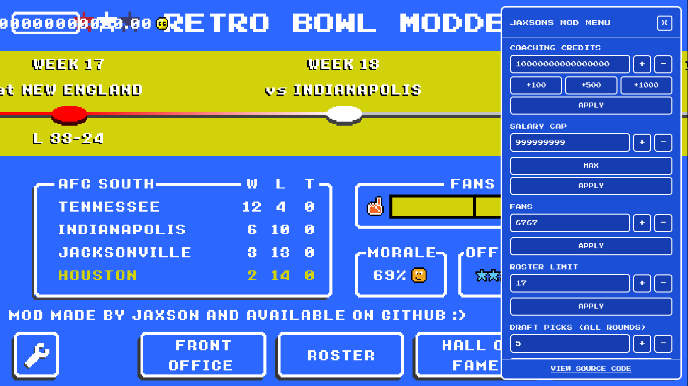

# Retro Bowl Modded

A fan made version of Retro Bowl with a built in mod menu.

## Features

- In game mod menu
- Coaching credits editor
- Salary cap editor
- Fans editor
- Roster limit control
- Draft picks for all rounds
- Facilities max / reset
- Export and import saves as JSON
- Optional starter save on first launch
- Unlocked full version / no nag walls in the web build

## Preview

## Controls

- Click **MOD MENU** to open the mod menu
- **X** closes it
- **/** hides or shows the entire mod menu
- Apply a value, then the game reloads so changes stick

## Starter save

On first visit you can load `saves/starter.json`, a pre built save with high credits, salary, facilities, and roster content.

> [!WARNING]
> **UNOFFICIAL FAN PROJECT**
>
> Retro Bowl is owned and developed by **New Star Games**.
> This is an unofficial fan made project and is **not affiliated with,
> endorsed by, or sponsored by New Star Games**.
>
> All Retro Bowl trademarks, copyrights, and other intellectual property
> remain with their respective owners.
> please dont sue me

## Contributing

Contributions are welcome. Before submitting changes, please read the project's [Contributing Guidelines](CONTRIBUTING.md).

The contributing guidelines cover the expected project structure, UI standards, save data handling, development setup, pull requests, and issue reporting.

## License

The original code and modifications in this repository are licensed under the [MIT License](LICENSE), unless otherwise stated.

The MIT License applies only to material that is actually covered by that license. It does not grant rights to third party trademarks, copyrighted material, game assets, or other intellectual property belonging to their respective owners.

See [LICENSE](LICENSE) for the full license text.